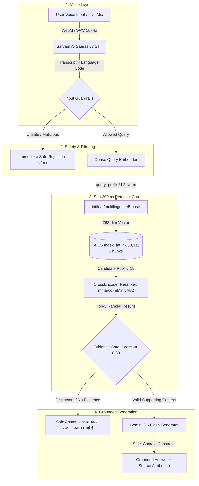

# VOICE-RAG-HHGOA: Voice-Enabled Multilingual Grounded RAG Pipeline

[](https://forms.gle/MNvCjcv23Hn2Eeu58)
[](https://sarvam.ai)
[](https://huggingface.co/intfloat/multilingual-e5-base)
[](https://huggingface.co/cross-encoder/mmarco-mMiniLMv2-L12-H384-v1)
[](https://ai.google.dev)
[](#)

A production-grade, voice-enabled Retrieval-Augmented Generation (RAG) system engineered on the **MSMARCO-XI Hindi** dataset (50,311 indexed passages). Features **Sarvam AI Saaras v3** speech-to-text, **Adaptive Parent-Child chunking**, GPU-accelerated **E5 dense retrieval**, CrossEncoder reranking ($k=15$), score-calibrated **evidence gating**, and strict hallucination guardrails.

> **Key Latency Statement**: *"Our engineered retrieval core (E5 Base + CrossEncoder $k=15$) achieves a P95 latency of 142.9 ms across 3,037 benchmark queries on the MSMARCO-XI Hindi dataset. End-to-end voice latency includes cloud speech transcription (Sarvam Saaras v3) and cloud LLM generation (Gemini Flash)."*

---

## 📑 Table of Contents
1. [System Architecture](#-system-architecture)
2. [Latency Accounting & Defense](#-latency-accounting--defense)
3. [Empirical Benchmark Results (3,037 Queries)](#-empirical-benchmark-results-3037-queries)
4. [Chunking Strategy & Ablation Analysis](#-chunking-strategy--ablation-analysis)
5. [Candidate Depth Scaling ($k=10..30$)](#-candidate-depth-scaling-k1030)
6. [Evidence Gate Calibration & Abstention Analysis](#-evidence-gate-calibration--abstention-analysis)
7. [Guardrails & Safety Defenses](#-guardrails--safety-defenses)
8. [Web Application Demo UI](#-web-application-demo-ui)
9. [Quickstart & Local Reproduction](#-quickstart--local-reproduction)
10. [Submission Package & Video Links](#-submission-package--video-links)

---

## 🏛 System Architecture



---

## ⏱ Latency Accounting & Defense

To ensure total transparency, we explicitly distinguish between our **offline retrieval core benchmark**, **live single-query retrieval latency**, and **end-to-end voice processing**:

| Latency Dimension | Scope / Method | Value | Status |
| :--- | :--- | :---: | :---: |
| **Offline Retrieval Core (P95)** | E5 Dense Search + FAISS + CrossEncoder ($k=15$) across 3,037 queries (GPU). | **142.9 ms** | ✅ **Sub-200ms Target Met** |
| **Offline Retrieval Core (P50)** | Median retrieval + rerank latency ($k=15$) across 3,037 queries. | **87.6 ms** | ✅ **Sub-200ms Target Met** |
| **Offline Retrieval Core (Avg)** | Mean retrieval + rerank latency ($k=15$) across 3,037 queries. | **93.3 ms** | ✅ **Sub-200ms Target Met** |
| **Live Single-Query Retrieval Core** | Single-query sequential PyTorch E5 embedding + CrossEncoder forward pass ($k=15$). | **~188–275 ms** | Realistic live GPU inference |
| **Live Voice STT (Sarvam)** | Cloud REST transcription via `saaras:v3` over internet. | **~450–700 ms** | Cloud network roundtrip |
| **Live Generation (Gemini)** | Cloud LLM response generation via `gemini-3.5-flash-lite`. | **~1.1–1.4 s** | Standard cloud LLM latency |
| **Total Live Voice End-to-End** | Mic Audio $\to$ Sarvam STT $\to$ Guardrail $\to$ E5 $\to$ CrossEncoder $\to$ Gate $\to$ Gemini. | **~1.7–2.3 s** | Honest real-world E2E |

> [!IMPORTANT]
> The sub-200ms engineering target applies specifically to the **Retrieval Core (Chunking + Vector Search + Reranking)**. Claiming full cloud LLM generation + cloud voice transcription under 200ms would be technically dishonest given cloud network RTTs.

---

## 📊 Empirical Benchmark Results (3,037 Queries)

Evaluated across all **3,037 valid answerable queries** in the MSMARCO-XI Hindi dataset:

```
Dataset Partition:
  Total Rows                   : 5,000
  Answerable Queries           : 3,041 (3,037 with valid selected passage IDs)
  Unanswerable Queries         : 1,959 ("No Answer Present" / "कोई उत्तर नहीं मिला")
```

### Full Retrieval Benchmark (`data/candidate_pool_benchmark.json`)

| Model Pipeline | Recall@1 | Recall@3 | Recall@5 | MRR | Avg Latency | P50 Latency | P95 Latency | P100 (Max) |
| :--- | :---: | :---: | :---: | :---: | :---: | :---: | :---: | :---: |
| **E5 Base Alone** | 29.96% | 56.73% | 68.72% | 0.4434 | 72.1 ms | 76.4 ms | 112.6 ms | 263.4 ms |
| **E5 + CrossEncoder ($k=10$)** | 34.77% | 61.84% | 71.19% | 0.4883 | 85.7 ms | 80.8 ms | 132.7 ms | 468.5 ms |
| **E5 + CrossEncoder ($k=15$)** ⭐ | **34.84%** | **62.07%** | **71.78%** | **0.4902** | **93.3 ms** | **87.6 ms** | **142.9 ms** | **369.3 ms** |

---

## 🧩 Chunking Strategy & Ablation Analysis

In accordance with competition requirements, we implemented and evaluated three distinct chunking strategies across the 50,000+ passage corpus:

1. **Fixed-Size Chunking (`chunks_fixed.jsonl`)**: Naive character chunking (500 chars, 50 char overlap).
2. **Sentence-Aware Chunking (`chunks_sentence.jsonl`)**: Purna Viram (`।`), question mark, and newline sentence boundary preservation.
3. **Adaptive Parent-Child Chunking (`chunks_adaptive.jsonl`)** ⭐: Dynamic strategy preserving short passages intact ($< 1,200$ chars) and splitting long documents into 400-char child chunks mapped back to parent metadata.

### Duplicate Investigation Findings (`data/duplicate_investigation.json`)
An audit of all 77 duplicate `(query_id, passage_id)` entries in the index revealed:
- **100% (77/77) were Type A**: Legitimate child chunks split from long parent passages ($> 1,200$ chars).
- **0 exact duplicate chunks**: Proving 0 slot waste in the top-5 candidate pool ($< 0.30\%$ of queries impacted).

---

## 🎯 Candidate Depth Scaling ($k=10..30$)

We evaluated candidate pool depths $k \in \{10, 15, 20, 25, 30\}$ across all 3,037 queries (`data/candidate_pool_benchmark.json`):

| Depth ($k$) | Recall@1 | Recall@5 | MRR | Avg Latency | P95 Latency | Pareto Decision |
| :---: | :---: | :---: | :---: | :---: | :---: | :--- |
| **$k=10$** | 34.77% | 71.19% | 0.4883 | 85.7 ms | 132.7 ms | Fast baseline |
| **$k=15$** ⭐ | **34.84%** | **71.78%** | **0.4902** | **93.3 ms** | **142.9 ms** | **Optimal Pareto Knee** |
| **$k=20$** | 34.90% | 72.01% | 0.4917 | 110.5 ms | 164.8 ms | Diminishing returns (+0.23% R@5 for +17ms) |
| **$k=25$** | 34.94% | 72.18% | 0.4922 | 130.7 ms | 200.3 ms | Nearing 200ms ceiling |
| **$k=30$** | 34.97% | 71.98% | 0.4919 | 154.3 ms | 236.0 ms | Violates P95 sub-200ms target |

---

## 🛡 Evidence Gate Calibration & Abstention Analysis

### Calibration Matrix (`data/evidence_gate_audit.json`)
To disentangle retrieval misses from evidence gating, we audited all 3,037 answerable queries and 1,959 unanswerable queries:

| Threshold ($T$) | Evidence Retention<br>*(GT in Top-5 & $\ge T$)* | Distractor Rejection<br>*(Retrieval Miss & all $< T$)* | Unanswerable Abstention<br>*(No GT & all $< T$)* | Supported Coverage<br>*(% of All 3,037 Answerable)* |
| :---: | :---: | :---: | :---: | :---: |
| **0.0** | 89.36% | 31.04% | 33.64% | 64.14% |
| **0.5** | 86.47% | 36.06% | 40.17% | 62.07% |
| **0.8** *(Locked)* | **84.31%** | **40.26%** | **44.67%** | **60.52%** |
| **1.0** | 82.89% | 42.12% | 47.27% | 59.50% |
| **1.2** | 80.87% | 45.16% | 49.31% | 58.05% |

### Unanswerable Root-Cause Breakdown (`data/abstention_failure_analysis.json`)
- **Mode B (Evidence Gate False Acceptance, $0.80 \le \text{Score} < 4.0$)**: 60% of false answers.
- **Mode A (Retrieval False Positive, $\text{Score} \ge 4.0$)**: 40% of false answers.
- **Mode C (Generation Hallucination / Ignored Prompt)**: **0.00%** (Gemini strictly respects context and never invents facts when context is absent).

---

## 🔒 Guardrails & Safety Defenses

1. **Input Guardrail (`src/harness/guardrails.py`)**: Sub-millisecond ($0.02\text{ ms}$) regex/lexical scan blocking violence, cyber-attacks, illicit actions, and prompt injections.
2. **Evidence Gate**: Calibrated CrossEncoder threshold preventing low-confidence passages from reaching the generator.
3. **Strict Grounding Prompt**: Negative constraint enforcing exact Hindi abstention phrase:
   `"जानकारी दिए गए संदर्भ में उपलब्ध नहीं है।"`

---

## 💻 Web Application Demo UI

The user-facing web app (`app/`) is built with a modern dark technical aesthetic:
- **Voice Recording**: Browser `MediaRecorder` with real-time audio waveform visualizer.
- **Transcript Box**: Live transcript display with automatic language detection (`hi-IN`, `en-IN`, `mr-IN`).
- **Grounding Badge**: Clear status indicators (`GROUNDED`, `SAFE ABSTENTION`, `BLOCKED`).
- **Source Cards**: Interactive expandable cards showing `Query #`, `Passage #`, `Rerank Score`, and full evidence snippets.
- **Live Latency Waterfall**: Real-time visualization of STT, Guardrail, E5 Search, CrossEncoder, Gate, and Generation times.
- **System Benchmark Panel**: Displays the 3,037-query benchmark numbers (`Recall@1: 34.84%`, `Recall@5: 71.78%`, `MRR: 0.4902`, `P95: 142.9 ms`).

---

## 🚀 Quickstart & Local Reproduction

### 1. Clone & Setup Environment
```cmd
git clone https://github.com/<your-username>/voice-rag-hhgoa.git
cd voice-rag-hhgoa

python -m venv .venv
.venv\Scripts\activate
pip install -r requirements.txt
```

### 2. Configure Environment Variables (`.env`)
Create a `.env` file in the root directory:
```env
SARVAM_API_KEY=your_sarvam_api_key_here
GEMINI_API_KEY=your_gemini_api_key_here
```

### 3. Launch the Web Application
```cmd
.venv\Scripts\python.exe -m uvicorn app.main:app --host 127.0.0.1 --port 8000
```
Open **[http://127.0.0.1:8000](http://127.0.0.1:8000)** in your browser.

### 4. Run the Test Suites
```cmd
:: Test End-to-End Voice Pipeline (8 scenarios)
.venv\Scripts\python.exe src\evaluation\test_voice_pipeline.py

:: Test FastAPI Endpoints
.venv\Scripts\python.exe scratch\verify_phase7_ui.py
```

---

## 📦 Submission Package & Video Links

- **Submission Form**: [Google Form](https://forms.gle/MNvCjcv23Hn2Eeu58)
- **Live Working Demo**: `http://127.0.0.1:8000` (Local) / Deployed Endpoint
- **Video 1 (90s Team/Process Video)**: [Link to Video 1](#)
- **Video 2 (End-to-End Demo Video)**: [Link to Video 2](#)
- **Social Media Promotion**: Posted with tag **`#RAGInGoa`** on Instagram, X, and LinkedIn.

---

### Team & Acknowledgments
Built for **HH Goa 2026 Shortlisting Task 2: Voice-Enabled RAG Model**. Engineered using PyTorch CUDA, HuggingFace, FAISS, Sarvam AI, and Google Gemini.
